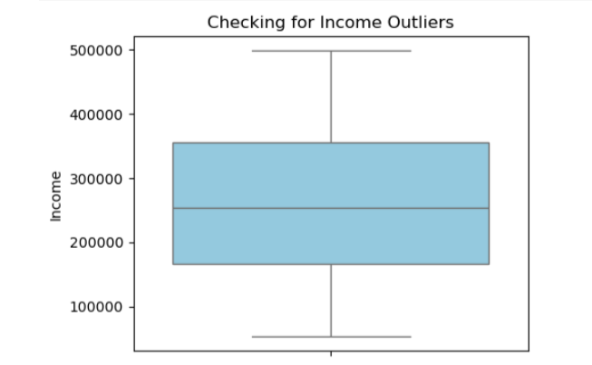
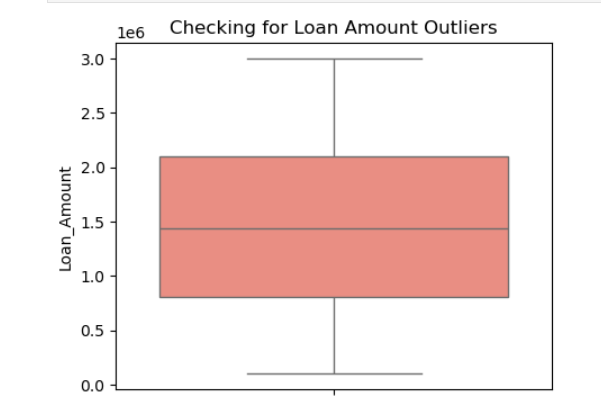
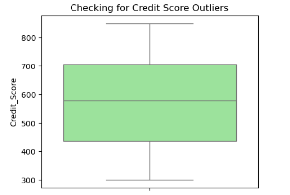
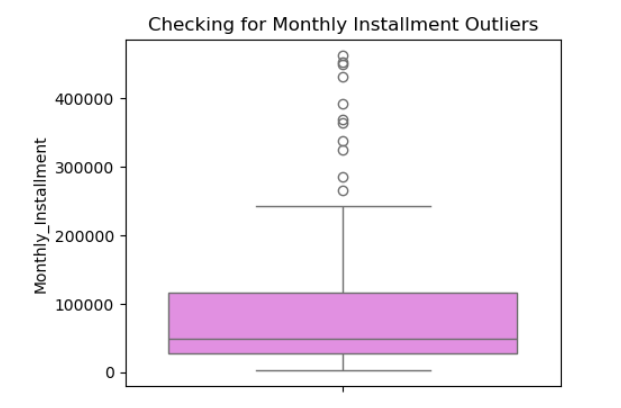
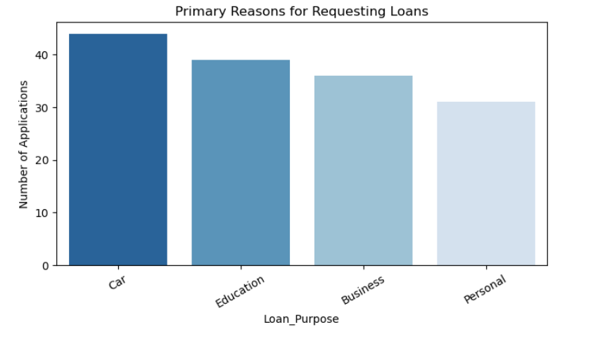
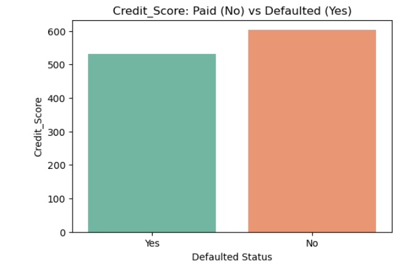
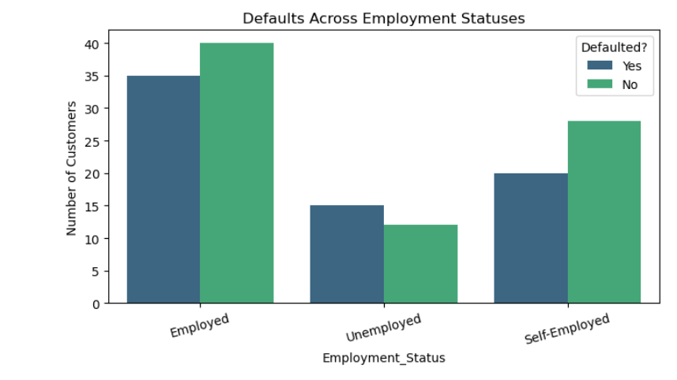
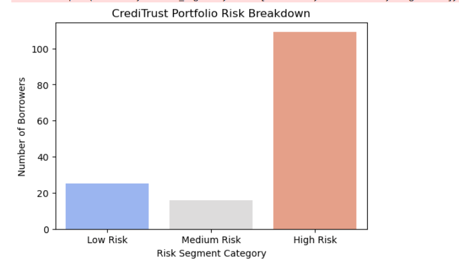
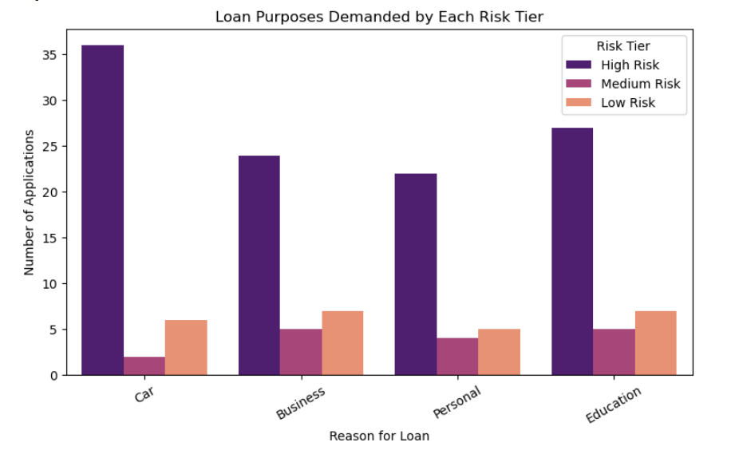

# 🏦 CrediTrust: Loan Risk and Customer Default Analysis

# Table of Contents

- [Project Overview](#project-overview)
- [Dataset Overview](#dataset-overview)
- [Business Problem](#business-problem)
- [Project Objectives](#project-objectives)
- [Tools Used](#tools-used)
- [Data Preparation](#data-preparation)
- [Executive Summary](#executive-summary)
- [Key Business Insights](#key-business-insights)
- [Business Recommendations](#business-recommendations)
- [Skills Demonstrated](#skills-demonstrated)
- [Conclusion](#conclusion)
- [Connect With Me](#connect-with-me)
---
## Project Overview

Loan defaults are a major challenge for financial institutions because they increase financial risk and reduce profitability.

This project analyses customer loan data from CrediTrust to identify patterns in borrower behaviour, uncover the key drivers of loan default, and support better lending decisions.

Using Python, the analysis transforms raw data into meaningful insights through data preparation, exploratory data analysis, customer risk segmentation, and business recommendations.

---
## Dataset Overview

The dataset contains **150 customer loan records** across multiple variables, including age, income, loan amount, credit score, employment status, loan purpose, and repayment status.

It was provided by **Tech Studio Academy** as part of a project-based data analytics programme for credit risk analysis.

---

## Business Problem

CrediTrust is experiencing an increase in loan defaults and needs a better way to identify high-risk borrowers.

Without clear insights into the factors associated with default, lending decisions become more difficult and the risk of financial loss increases.

This project analyzes customer and loan data to identify default patterns, classify borrowers by risk level, and provide data-driven recommendations to improve credit risk management.

---
## Project Objectives

The primary objectives of this project are to:

- Improve data quality through cleaning and validation.
- Identify the factors associated with loan default.
- Classify borrowers into risk categories.
- Support lending decisions with data-driven insights.
- Recommend strategies to reduce default risk and improve portfolio performance.

---
## Tools Used

- **Python:** Used for data cleaning, exploratory data analysis, feature engineering, and customer risk segmentation.
- **Pandas:** Used for data manipulation, transformation, and analysis.
- **Jupyter Notebook:** Used to develop and document the end-to-end analytical workflow.
---
## Data Preparation

Before the analysis, the dataset was reviewed and prepared to ensure the findings were based on accurate and reliable data.

- Checked for missing values and confirmed that all records were complete.
- Verified that there were no duplicate records in the dataset.
- Reviewed the dataset structure to ensure variables were stored in the correct format for analysis.
- Assessed key numerical variables for unusual or extreme values that could affect the results.
- Converted the loan default status from text values (`Yes`/`No`) into numerical values (`1`/`0`) to support default rate calculations and risk analysis.

### Missing Values Check

### Duplicate Records Check

### Dataset Structure Review

### Outlier Assessment

The boxplots showed no unrealistic or incorrect values across the key numerical variables. This confirmed that the dataset was suitable for analysis and that the results would not be distorted by data quality issues.

### Feature Engineering

 A new numerical target variable (`defaulted_numeric`) was created by converting loan default status from text values (`Yes`/`No`) into numerical values (`1`/`0`). This made it possible to calculate default rates and perform risk-based analysis.
 

  Created a `Risk_Segment` feature using a rule-based classification model to categorize borrowers into **High Risk**, **Medium Risk**, and **Low Risk** groups based on their credit score and previous default history.

---
## Executive Summary

The analysis revealed a high-risk lending portfolio with a significant concentration of borrowers likely to default.

| KPI | Value |
|------|-------|
| Portfolio Default Rate | 46.67% |
| High-Risk Borrowers | 109 (72.7%) |
| Total Borrowers | 150 |
| Total Capital Deployed | $218.1M |
| Average Loan Amount | $1.45M |
| Expected Monthly Cash Inflow | $13.46M |

> **Key Finding:** Nearly **1 in every 2 borrowers** has defaulted on their loan, while **72.7% of customers** were classified as high risk. These findings suggest that the current loan portfolio is heavily exposed to credit risk and may require stricter lending criteria and risk controls.

---
## Key Business Insights
---
### 1. What are the primary reasons why customers request loans from CrediTrust?
---

Personal and Business loans account for the largest share of loan applications. This shows that most customers borrow for personal needs or business-related expenses, making these the most important loan categories within the portfolio.

---

### 2. Do borrowers who default have lower credit scores?
---

Borrowers who defaulted had an average credit score of **532**, compared to **602** for borrowers who repaid successfully. This 70-point difference shows that credit score is one of the strongest indicators of whether a borrower is likely to default.

---

### 3. Does a borrower's employment status affect their likelihood of defaulting?
---

Default rates were highest among unemployed borrowers, while self-employed borrowers also showed relatively high default levels. This suggests that borrowers with less stable income may find it more difficult to keep up with loan repayments.

---

### 4. How many borrowers fall into High, Medium, and Low risk tiers?
---

Borrowers were grouped into High, Medium, and Low risk categories using a rule-based risk model. The analysis showed that **72.7%** of borrowers fall into the High-Risk category, indicating that a large portion of the portfolio is exposed to potential credit losses.

---

### 5. Which loan purposes are our "High Risk" segments mostly applying for?
---

High-risk borrowers were found across all loan categories but were most concentrated in Personal and Business loans. This suggests that these loan types may require stricter approval criteria and closer monitoring to reduce future defaults.

---
## Business Recommendations
---
### 1. Strengthen Credit Score Requirements

Introduce stricter review processes for applicants with credit scores below 600 and require additional risk assessments before loan approval.

### 2. Tighten Lending Criteria for Unemployed Applicants

Require collateral, a qualified guarantor, or additional evidence of repayment capacity before approving loans for unemployed applicants.

### 3. Improve Income Verification for Self-Employed Borrowers

Verify income using recent bank statements, tax records, or other financial documentation instead of relying solely on declared income.

### 4. Implement an Automated Early Warning System

Deploy automated alerts for missed payments, declining credit scores, or other indicators of financial distress so that high-risk accounts can be identified and managed proactively.

---

## Skills Demonstrated
---
- Data Cleaning & Validation
- Exploratory Data Analysis (EDA)
- Feature Engineering
- Risk Analysis
- Customer Risk Segmentation
- Data Visualization
- Business Insight Generation
- Data-Driven Decision Making
---
##  Conclusion

This analysis showed that loan defaults at CrediTrust are strongly influenced by factors such as credit score, employment status, and borrower risk level. The findings also revealed that a large proportion of the current loan portfolio falls within the High-Risk category, increasing the company's exposure to potential losses.

By strengthening credit assessment processes, improving borrower verification, and implementing proactive risk monitoring, CrediTrust can make more informed lending decisions and reduce future default risk.

---
## Connect With Me

Let's connect:
LinkedIn: [Peace Adaobi](https://www.linkedin.com/in/peace-ada-95b341341)  
Email: [peaceada100@gmail.com](mailto:peaceada100@gmail.com)
